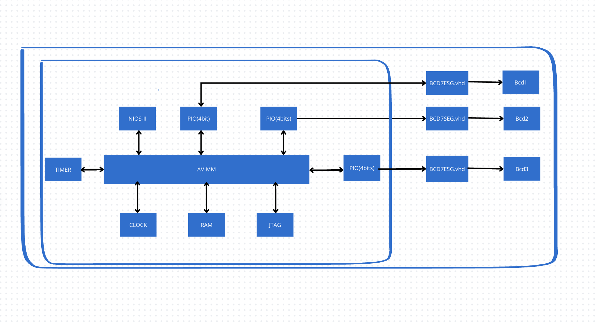
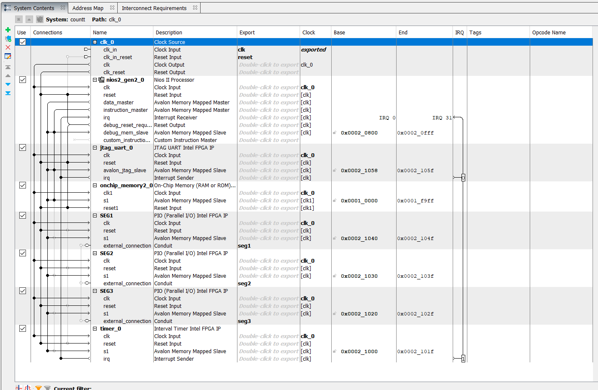
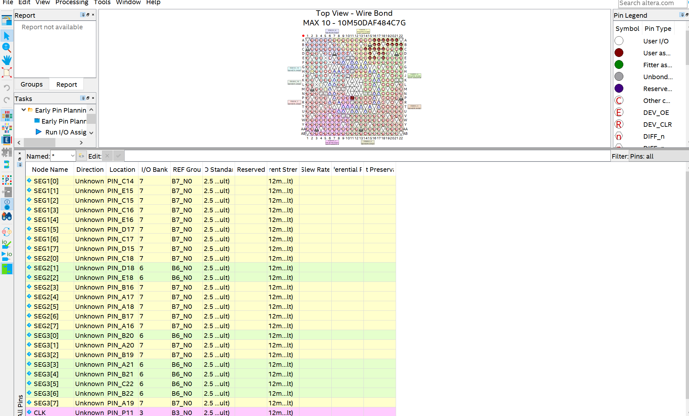
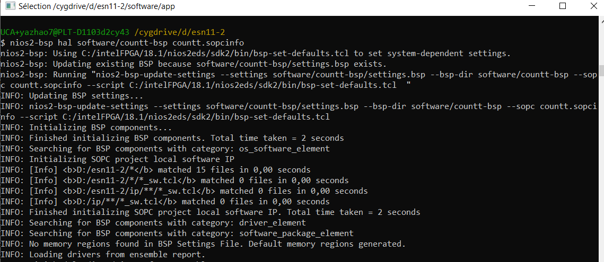
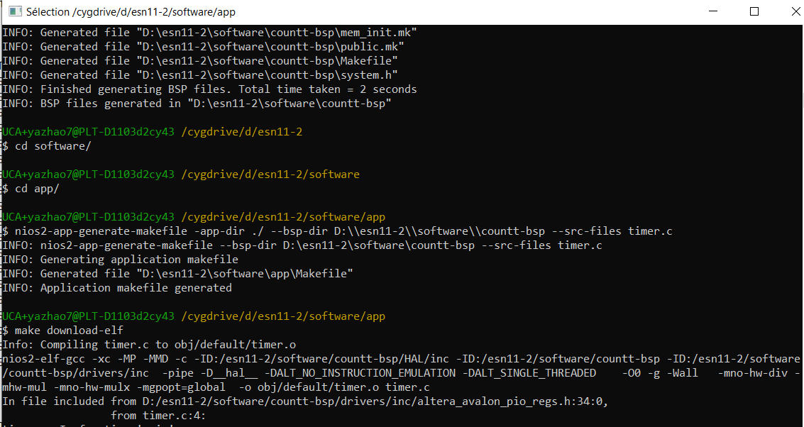

# Zhao_lab2
## Introduction
L’objectif de ce rapport est de présenter le travail réalisé dans le cadre des travaux pratiques de l’UE Conception Conjointe, visant à approfondir nos connaissances et à les appliquer à travers la création d’une architecture NIOS permettant de coder un compteur BCD en langage C. Le cahier des charges était précis : utiliser la plate-forme DE10 équipée d’un FPGA Max-10 pour concevoir un compteur BCD affichant la valeur en hexadécimal sur trois afficheurs 7 segments. Le compteur devait s’incrémenter chaque seconde grâce à une interruption générée par un Timer.

## Architecture du sytème

Le système est composé d’une architecture de base comprenant un processeur Nios II, une mémoire RAM, une horloge (Clock) et un port JTAG. À cette architecture de base s’ajoutent des périphériques supplémentaires, notamment un PIO de 4 bits pour le premier afficheur 7 segments, un PIO de 4 bits pour le deuxième afficheur 7 segments, un PIO de 4 bits pour le troisième afficheur 7 segments, ainsi qu’un Timer de 32 bits réglé sur une période de 1 seconde.

## Platform Designer
L'architecture sous Platform Designer (QSYS) est donc la suivante :

## Quartus
Dans Quartus, nous avons tout d’abord écrit le composant bcd.vhd, utilisé pour afficher un nombre binaire de 4 bits sur un afficheur 7 segments. Ensuite, nous avons rédigé le fichier de haut niveau count.vhd, permettant de relier les composants créés dans QSYS au bloc BCD7SEG via des signaux. Par la suite, nous avons utilisé l’outil Pin Planner pour effectuer l’attribution des broches. Enfin, après une compilation complète du design, l’architecture peut être programmée sur la carte de développement.

## Nios-II
À l’aide du terminal Nios II, nous commençons par exécuter la commande suivante pour générer le fichier BSP (Board Support Package) :  

Ensuite, nous utilisons la commande suivante pour créer le fichier Makefile :

Une fois ces étapes terminées, nous pouvons écrire un script en langage C, le compiler, puis le téléverser sur la carte de développement pour l’exécuter.

## Compteur avec interruptions
Le fichier timer.c implémente un compteur piloté par un timer, lequel génère une interruption toutes les 1 seconde. L’interruption créée via la fonction alt_irq_register() appelle une fonction nommée timer_irq(), où la variable cpt est incrémentée. Cette valeur est ensuite décomposée et affichée selon la méthode utilisée dans le code précédent.

De plus, j’ai ajouté une fonctionnalité permettant de modifier la vitesse du compteur en modifiant directement les registres periodl et periodh du timer en langage C. Cette fonctionnalité est mise en œuvre grâce aux macros IOWR_ALTERA_AVALON_TIMER_PERIODL et IOWR_ALTERA_AVALON_TIMER_PERIODH.
## Résultats

https://github.com/user-attachments/assets/2cf407dc-8483-4b03-a847-a54d347fa558

## Conclusion
Grâce à ce projet, nous avons approfondi notre compréhension du fonctionnement des afficheurs numériques et maîtrisé le processus de développement sur FPGA et NIOS II. Nous nous sommes également familiarisés avec l’utilisation des timers, des interruptions et la construction de systèmes QSYS. Dans la partie logicielle, nous avons appris à convertir des nombres décimaux en codes BCD et à implémenter des délais, tandis que dans la partie matérielle, nous avons acquis les compétences nécessaires pour afficher des nombres binaires sur des afficheurs numériques.

La complexité du deuxième projet a été un défi supplémentaire. Nous avons relevé avec succès les difficultés liées à la création et à l’intégration des modules VHDL, ainsi qu’à la mise en œuvre des timers dans le code. Ces deux projets nous ont permis de consolider nos connaissances théoriques, d’améliorer considérablement nos compétences en développement FPGA et de réaliser avec succès tous les objectifs du design.
